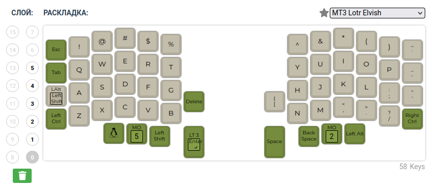
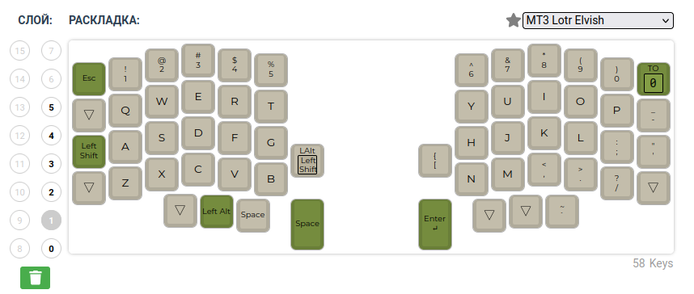
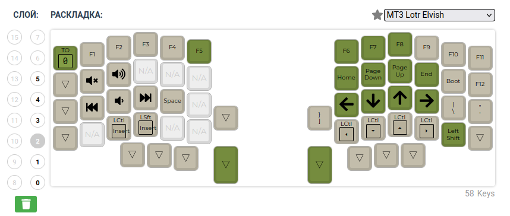
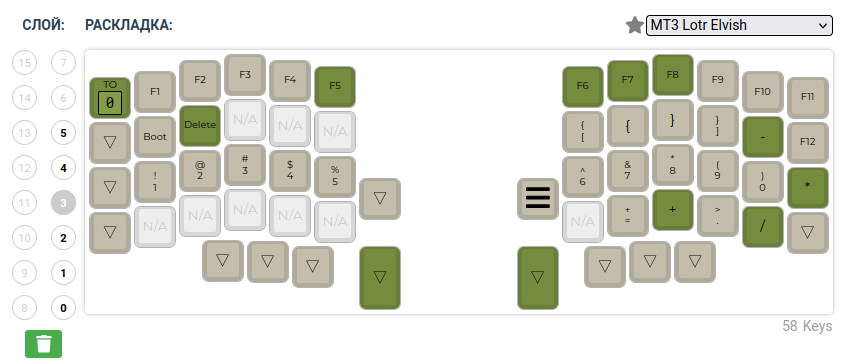
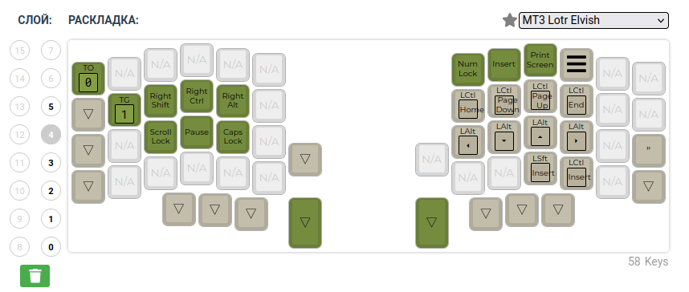
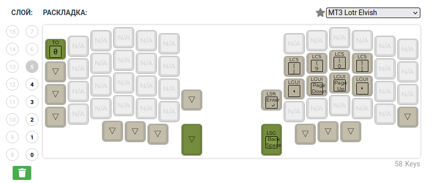

# Описание

Раскладка druotoni для lily58

## Подготовка

```bash
git clone https://github.com/Feelinglight/qmk_firmware.git
git checkout druotoni
git submodule update -j 8 --init --recursive
cd qmk_firmware
uv venv
uv pip install qmk
```

## Прошивка

- Левая половинка:

  - Подключить type-c к левой половинке
  - Выполнить

    ```bash
    uv run make flash_left
    ```

  - Нажать RESET

- Правая половинка:

  - Подключить type-c к правой половинке
  - Выполнить

    ```bash
    uv run make flash_right
    ```

  - Нажать RESET

## Изменение раскладки

Раскладка меняется через [Web UI](https://config.qmk.fm/#/lily58/rev1/LAYOUT)

В конфигуратор загружается файл **./keyboards/lily58/keymaps/druotoni/**, меняется раскладка и
загружается измененная json-конфигурация.

Для генерации c-файла выполнить ``make json2c``

## Слои













